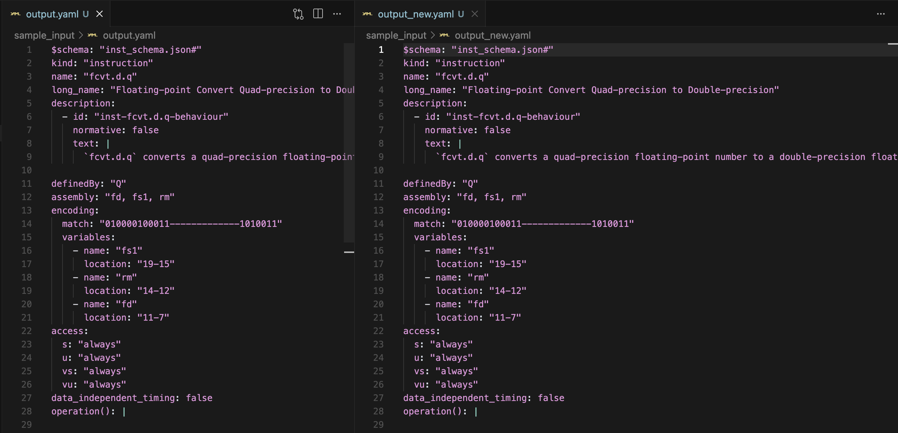

# Code Gen: From UDB to Implementations - Coding Challenge
### Hsieh Yu Hsuan
## Overview

This project implements a code generation workflow with YAML, Python and C files:

1. **Python Program**: Reads YAML files under designate folder, and converts the YAML data into a generated C header file. The output C header files are stored under designate output folder.

2. **C Program**: Includes the generated C header file and emits the contents of the header as a YAML file.

3. **Repeat Conversion with Generated YAML**: The same Python program then reads the emitted YAML from step 2 as input and generates a new C header file.

4. **Identical YAML Emission**: The C program again reads this second generated header file and emits YAML. This time, the emitted YAML should exactly match the YAML input this time (from step 3).
   
---

## Files in this project
- yaml_to_c.py: Python script handling YAML → C header conversion
- emit_yaml.c: C program handling C header → YAML emission
- sample_input: folder to store original YAML file
- sample_output folder to store generated headers
- This README.md describing the process
  
---

## How to Run

### Python Script

```bash
python3 yaml_to_c.py <input_yaml_folder> <output_header_folder>
```

### C Program

Modify the `#include "<input_header_file>"` directive to reference the desired header file.

```
gcc -o c_to_yamlemit_yaml.c
./c_to_yaml <output_yaml_file.yaml>
```

---

## Demo

In terminal, run: 

```bash
python3 yaml_to_c.py sample_input sample_output
```

- A folder named sample_output will be created (if it doesn't exist).
- The generated C header files will be stored inside this sample_output folder.

To compile and run the C program to convert the generated header back to YAML:

In the C file, remove existing #include that include header files , and replace them with:
`#include "sample_output/fcvt.d.q.h"`

In terminal, run:
```bash
gcc -o c_to_yaml c_to_yaml.c
./c_to_yaml sample_input/output.yaml
```

- The resulting `output.yaml` file will be saved under the `sample_input/` folder.

Next, generate another `.yaml` file by passing the previously generated `output.yaml` back through the Python script and C program:

```bash
python3 yaml_to_c.py sample_input sample_output
```

In the C file, we once again modify the header file include:
`#include "sample_output/output.h"`

In the terminal, run:
```bash
./c_to_yaml sample_input/output_new.yaml
```

Finally, compare the two generated YAML files for differences:

```bash
diff sample_input/output.yaml sample_input/output_new.yaml
```

We expect no differences between `output.yaml` and `output_new.yaml`.

### Demo Result Screenshot 
